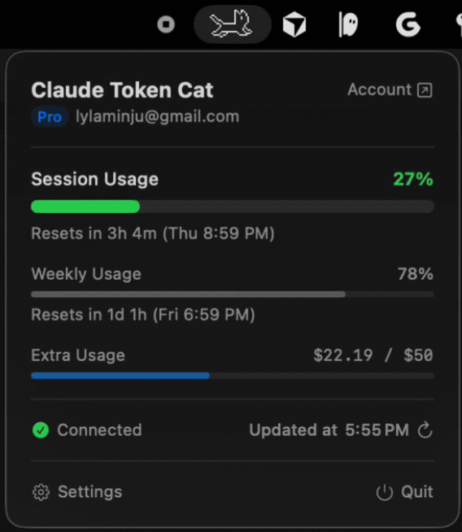
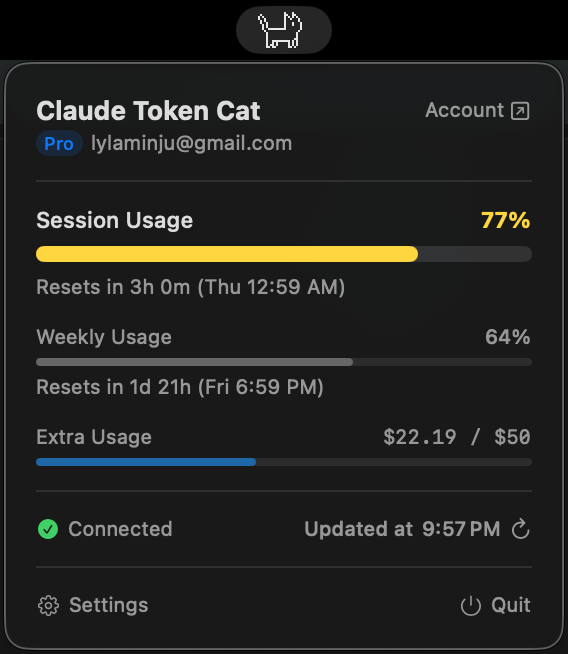
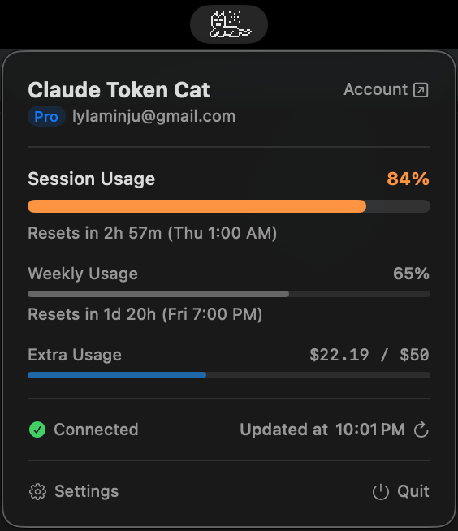
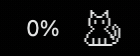
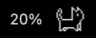
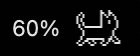
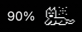
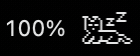

# TokenTrex

Un widget macOS que j'ai développé pour visualiser ma consommation de tokens Claude directement dans la barre de menu — avec un T-Rex animé en pixel art qui réagit en temps réel à mon usage.

  

---

## Pourquoi j'ai créé ça

J'utilise Claude Code tous les jours et je n'avais aucun moyen rapide de savoir où j'en étais dans ma fenêtre de session de 5 heures. Plutôt que d'ouvrir un navigateur à chaque fois, j'ai développé ce widget macOS qui affiche l'info directement dans la barre de menu — avec un T-Rex animé dont le comportement change selon le niveau d'utilisation.

---

## Comment ça fonctionne

Le T-Rex change d'animation selon le pourcentage de la fenêtre de session consommée :

| Usage | État | Animation |
|-------|------|-----------|
| Pas de session active | 🔵 idle |  |
| 0 – 39% | 🟢 jumping |  |
| 40 – 79% | 🟡 walking |  |
| 80 – 99% | 🟠 tired |  |
| 100% | 🔴 sleeping |  |

Un clic sur l'icône ouvre un dashboard avec :
- La **consommation de session** (fenêtre 5h) avec barre de progression et compte à rebours
- La **consommation hebdomadaire** (7 jours glissants)
- Les **crédits extra** (si activés sur ton compte)
- Le **type d'abonnement** (Free / Pro / Max / Team / Enterprise)
- L'heure de **dernière mise à jour** et un bouton de rafraîchissement manuel

---

## Prérequis

- macOS 13 Ventura ou supérieur
- [Claude Code CLI](https://www.npmjs.com/package/@anthropic-ai/claude-code) installé et connecté

---

## Installation

### Option 1 — Téléchargement direct

1. Télécharge `TokenTrex.dmg` depuis la page [Releases](../../releases)
2. Supprime l'attribut de quarantaine (l'app n'est pas signée) :
   ```bash
   xattr -d com.apple.quarantine ~/Downloads/TokenTrex.dmg
   ```
3. Ouvre le DMG et glisse `TokenTrex.app` dans ton dossier **Applications**
4. Lance l'app — le T-Rex apparaît dans ta barre de menu

> Au premier lancement, macOS demande l'accès au Keychain. Clique sur **Autoriser** pour activer le suivi en temps réel.

### Option 2 — Build depuis les sources

**Prérequis :** [Xcode](https://apps.apple.com/app/xcode/id497799835) (installation complète requise)

```bash
git clone https://github.com/LouiSvon/TokenTrex.git
cd TokenTrex
./build.sh
cp -r build/TokenTrex.app /Applications/
open /Applications/TokenTrex.app
```

---

## Configuration de Claude Code

TokenTrex lit les credentials de Claude Code CLI depuis le Keychain macOS. Il faut d'abord s'authentifier :

```bash
npm install -g @anthropic-ai/claude-code
claude login
```

Sans credentials valides, l'app passe en **mode démo** : le T-Rex s'anime quand même et un bouton "Cycle State" permet de tester tous les états.

---

## Paramètres

| Paramètre | Description |
|-----------|-------------|
| **Animation** | Activer / désactiver l'animation du T-Rex |
| **Pourcentage dans la barre** | Afficher le % d'usage à côté de l'icône |
| **Format de réinitialisation** | Relatif ("2h 30m"), absolu ("Ven 18:59") ou les deux |

---

## Confidentialité

Toutes les données restent sur ton Mac. TokenTrex communique uniquement avec `api.anthropic.com` — le même endpoint que Claude Code CLI. Aucune analytics, aucun tracking, aucun serveur tiers.

---

## Stack technique

- **Swift** — application macOS native
- **AppKit + SwiftUI** — interface barre de menu et popover
- **Swift Package Manager** — gestion du build
- **OAuth 2.0** — authentification via les credentials Claude Code
